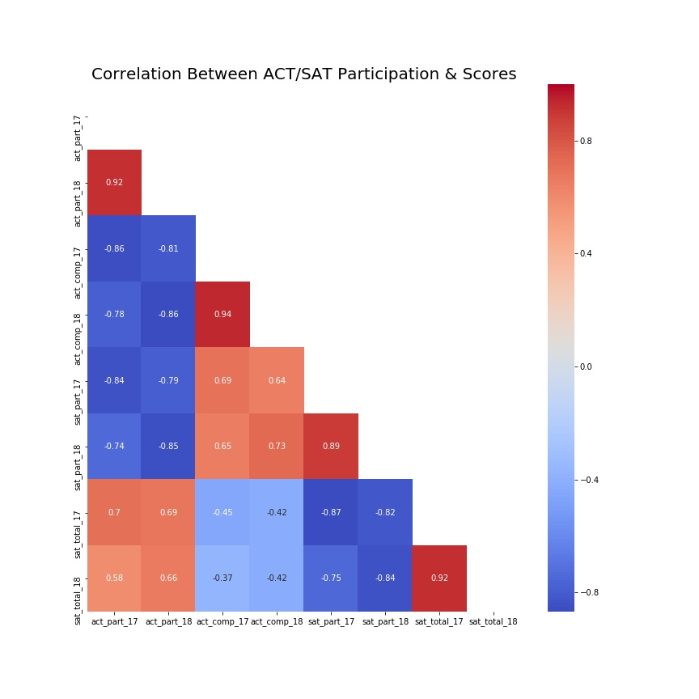

# SAT_ACT_Analysis
Analysis of SAT &amp; ACT Participation Rates and Recommendation for the College Board on A State to Focus Efforts for Increased Participation

Authored by: Magnus Bigelow

# Problem Statement¶
The SAT and ACT play a prominent role in the lives of young Americans as the primary tests taken by prospective college students to demonstrate their college readiness. As important gatekeepers to a college education, and determinants in which college a student is admitted to both tests see a great degree of scrutiny and are constantly considering potential revisions. In 2016 the SAT decided to shorten the test and revise the content in order to better test for skill's needed in college and reduce the reliance on 'tricks' and specific prep for the test.

With a dataset of average scores and participation in the SAT and ACT by state for the years 2017 and 2018 we will look at states that have had large increases or decreases in SAT / ACT participation and identify why those states have seen such swings. Then we will identify a state that is ripe for the SAT to increase their presence in and recommend strategies to increase participation.

## Data Sources & Data Dictionary

The data used for this project was compiled from the following locations: 
    [2017 SAT](https://blog.collegevine.com/here-are-the-average-sat-scores-by-state/)
    [2018 SAT](https://reports.collegeboard.org/sat-suite-program-results/state-results)
    [2017 ACT](https://blog.prepscholar.com/act-scores-by-state-averages-highs-and-lows)
    [2018 ACT](http://www.act.org/content/dam/act/unsecured/documents/cccr2018/Average-Scores-by-State.pdf)
    
|Feature|Type|Dataset|Description|
|:---|:---:|:---:|---:|
|**state**|*object*|ACT/SAT|State name|
|**'test'_part_'year'**|*float*|ACT/SAT|Participation percentage for students in a given state, test & year (0 - 100)|
|**sat_ebrw_'year'**|*int*|SAT|Average Evidence Based Reading & Writing score for students in a given state and year (200 - 800)|
|**sat_math_'year'**|*int*|SAT|Average Math score for students in a given state and year (200 - 800)|
|**sat_total_'year'**|*int*|SAT|Average combined EBRW & Math score for students in a given state and year (400 - 1600)|
|**act_math_17**|*float*|ACT|Average Math score for students in a given state and year (1 - 36)|
|**act_engl_17**|*float*|ACT|Average English score for students in a given state and year (1 - 36)|
|**act_sci_17**|*float*|ACT|Average Science score for students in a given state and year (1 - 36)|
|**act_read_17**|*float*|ACT|Average Reading score for students in a given state and year (1 - 36)|
|**act_comp_'year'**|*float*|ACT|Average overal ACT score for a given state and year (1 - 36)|
|**'test'_part_inc**|*float*|ACT/SAT|Increase in participation percentage for students in a given state & test from 2017 to 2018 (-100 - 100)|
|**part_inc**|*float*|ACT/SAT|Increase in participation percentage for students in a given state for the SAT & ACT combined from 2017 to 2018 (-200 - 200)|
|**sat_dom_'year'**|*bool*|SAT/ACT|Whether or not the percentage of students taking the SAT was great than that of students taking the ACT in a given year & state|

**note**: feature names enclosed in ' ' denote several variables of the same type which are further demarcated as follows:

**'test'**: 'sat' if feature refers to the SAT and 'act' for the ACT

**'year'**: '17' if refers to 2017 and '18' if 2018

## Repo Structure

SAT_ACT_Participation_and_Score_Analysis.ipyb 
- Jupyter Notebook with full analysis

College Board Recommendations - Magnus Bigelow.pdf
- Presentation Summarizing Findings

Data
- Folder with initial and cleaned data

Exhibits
- Folder with pictures for presentation and choice visuals from analysis

## Executive Summary

For this problem I first cleaned and merged 4 datasets with data on participation rates and averge scores by state for the SAT and ACT in 2017 and 2018. 

Once the data was cleaned and merged, I performed EDA, looking for states with interesting patterns in SAT and ACT participation as well as correlation between the variables. One interesting chart shows the correlation between participation rate & average total scores in the SAT and ACT across 2017 and 2018.

This heatmap shows a couple interesting correlations: 
SAT & ACT participation are negatively correlated
- Analysis: 29 States have >95% participation in the SAT or ACT and most students are unlikely to take both tests

Test participation is negatively correlated with same test score
- Analysis: Students that take both tests are likely to be high achievers

Test participation and score are highly correlated with same test participation and score year to year
- Analysis: Few states see large swings in participation rates or scores

Additionally I looked at which states had more students take the SAT and ACT each year, summarized in the choropleth below

Using these findings along with other EDA, I circled in on Colorado, Illinois, Florida and Alaska as states that showed interesting trends in SAT and ACT participation rates and performed further research on why these states saw these trends.

My analysis showed that the top reasons for states to see large participation rate changes was due to policy changes / statewide mandates and the SAT's 'SAT School Day' Program. 

I further narrowed in on Arizona as a state that has high potential for increased participation and worthy of the College Board's increased attention.

## Conclusion & Reccomendations

From our understanding of which students are likely to fall through the cracks and which states are most in need of help, Arizona is our prime target for trying to increase participation. The state does not have a 'standard' (>2/3 participation) test and is along the Mexico boarder with a large % of immigrants. Additionally lessons learned from attempting to increase participation here can likely translate to nearby states of California and Texas which see similar patterns of participation and large percentage of immigrants.

**Recomendations for Increased Participation:**

Spread awareness of SAT programs and value
- Work with local policy makers, school administrators and parents, meaningful participation increase only happens when key stakeholder are bought in

Push for statewide SAT mandate
- Fastest, most effective way to increase participation

Highlight ‘SAT School Day’ and Khan Academy partnership
- Significant success in other geographies and highlights how College Board wants to work with students, parents and teachers

## Next Steps

- Examine more granular data at county or school district level
- Examine data split by race and socio-economic data
- Follow trends over a greater number of years
- Look more closely at state and local policies
